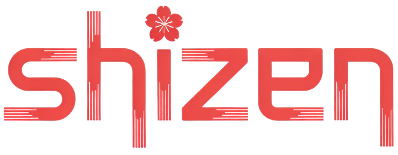

# Shizen

A minimalist, local-first personal management application inspired by Japanese harmony. Shizen provides a calm, distraction-free environment to manage your accounts, clipboard, and notes without external dependencies.



## 🌸 Philosophy

Shizen (自然) means "nature" or "natural" in Japanese. This application embodies the principles of simplicity, fluidity, and balance—creating a personal space where technology and tranquility meet.

## ✨ Features

- **🔐 Account Management**: Securely store and organize your credentials with category-based autocomplete
- **📋 Clipboard Manager**: Quick access to frequently used text snippets (coming soon)
- **📝 Notes**: Create and manage personal notes with a clean interface
- **🎨 Dark Theme**: Elegant dark mode design for comfortable extended use
- **💾 Local Storage**: All data stored locally in JSON format—no cloud, no tracking
- **🔒 Privacy First**: Complete offline functionality, your data never leaves your device
- **📦 Portable**: Export and import your data as JSON files
- **🖼️ Profile Customization**: Upload and crop your profile picture with an intuitive interface

## 🚀 Getting Started

### Option 1: Use Online (Recommended)

Visit the live application at: **[https://lucaslr2.github.io/shizen/](https://lucaslr2.github.io/shizen/)**

No installation required! Just open the link and start using Shizen directly in your browser.

### Option 2: Run Locally

If you prefer to run Shizen on your own machine:

1. Clone the repository:
```bash
git clone https://github.com/lucaslr2/shizen.git
cd shizen
```

2. Open `index.html` in your web browser

That's it! Shizen runs entirely in your browser with no server required.

## 📖 Usage

### First Time Setup

1. Open Shizen in your browser
2. Choose one of two options:
   - **Create Account**: Set up a new profile with your name and photo
   - **Load Account**: Import an existing JSON data file

### Creating Your Profile

1. Enter your full name
2. Upload a profile picture and use the cropping tool to adjust it
3. Select which tools you want to enable (Accounts, Clipboard, Notes)
4. Click "Crear cuenta" - your data file will be automatically exported

### Managing Accounts

- Click **"Nueva cuenta"** to add new credentials
- Use the autocomplete feature to group accounts by category
- Categories show a badge with the count of accounts in that group
- Toggle accounts active/inactive using the power button
- Copy usernames and passwords with one click
- Add optional notes for additional context (2FA codes, security questions, etc.)
- Edit or delete accounts as needed

### Managing Notes

- Create quick text notes for reminders, ideas, and information
- Edit or delete notes at any time
- Notes automatically display relative timestamps (Today, Yesterday, etc.)

### Data Management

**Exporting Data:**
- Click your profile picture in the header → **"Exportar datos"**
- Save the JSON file in a secure location
- This file contains all your accounts, notes, and settings

**Loading Data:**
- From the welcome screen, choose "Cargar cuenta"
- Drag and drop your JSON file or click to browse
- Your profile and all data will be restored

## 🔒 Security & Privacy

### Important Security Notes

- Shizen stores data in browser sessionStorage during your session
- **Your passwords are stored in plain text in the JSON export files**
- This is a local-first tool designed for convenience, not enterprise-level security
- Never share your JSON export files with others
- Store your exports in a secure location (encrypted drive, password manager, etc.)

### Recommendations

- Use Shizen on your personal device only
- Consider encrypting your JSON exports with tools like GPG or 7-Zip
- For sensitive accounts, consider using a dedicated password manager
- Always export your data before closing your session
- Use the "Cerrar sesión" button to clear sessionStorage when done

### Privacy

- No analytics, tracking, or telemetry
- No internet connection required (except for loading fonts and icons)
- All data processing happens locally in your browser
- No accounts, no sign-ups, no servers

## 🎨 Customization

Shizen uses CSS custom properties for easy theming. Edit the CSS files to customize:

**`css/shizen-styles.css` or `css/login-styles.css`:**
```css
:root {
    --accent-primary: #FF5252;      /* Main accent color */
    --accent-secondary: #81C784;    /* Secondary accent */
    --bg-primary: #121212;          /* Background color */
    /* ... and many more variables */
}
```

You can modify:
- Accent colors and gradients
- Background colors
- Spacing and typography
- Border radius and shadows
- Transitions and animations

## 🛠️ Technology Stack

- **Frontend**: Vanilla JavaScript (ES6+)
- **Styling**: Custom CSS with CSS Variables
- **Icons**: [Lucide Icons](https://lucide.dev/)
- **Storage**: Browser SessionStorage + JSON Export
- **Fonts**: [Inter](https://fonts.google.com/specimen/Inter) from Google Fonts

## 📁 Project Structure

```
shizen/
├── index.html              # Login/Welcome page
├── shizen.html            # Main dashboard
├── css/
│   ├── login-styles.css   # Styles for welcome page
│   └── shizen-styles.css  # Styles for dashboard
├── js/
│   ├── login.js           # Authentication and profile setup
│   └── shizen.js          # Dashboard functionality
└── resources/
    ├── logo-shizen-sf.png
    └── background-login.jpg
```

## 🎯 Roadmap

- [ ] Clipboard Manager implementation
- [ ] Search functionality across accounts and notes
- [ ] Dark/Light theme toggle
- [ ] Custom categories with icons
- [ ] Password strength indicator
- [ ] Password generator
- [ ] Bulk operations (export specific categories)
- [ ] Data encryption option
- [ ] Mobile-responsive improvements

## 🤝 Contributing

Contributions are welcome! Here's how you can help:

1. Fork the repository
2. Create a feature branch (`git checkout -b feature/amazing-feature`)
3. Commit your changes (`git commit -m 'Add amazing feature'`)
4. Push to the branch (`git push origin feature/amazing-feature`)
5. Open a Pull Request

### Areas for Contribution

- Bug fixes and improvements
- New features from the roadmap
- UI/UX enhancements
- Documentation improvements
- Translations to other languages

## 📝 License

This project is open source and available under the [MIT License](LICENSE).

## 🙏 Acknowledgments

- Inspired by Japanese design philosophy and the concept of "Ma" (間) - negative space
- Built with a focus on privacy, simplicity, and user autonomy
- Icons by [Lucide](https://lucide.dev/)
- Font by [Inter](https://rsms.me/inter/)

## 📧 Support

If you encounter any issues or have suggestions:
- Open an issue on GitHub
- Check existing issues before creating a new one
- Provide as much detail as possible (browser, OS, steps to reproduce)

## ⚠️ Disclaimer

Shizen is a personal project designed for convenience and local data management. It is not intended to replace professional password managers for highly sensitive information. Use at your own discretion and always maintain secure backups of your data.

---

**Made with 🌸 by embracing simplicity and nature**

> "Simplicity is the ultimate sophistication." - Leonardo da Vinci